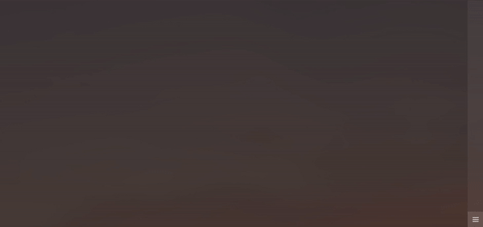
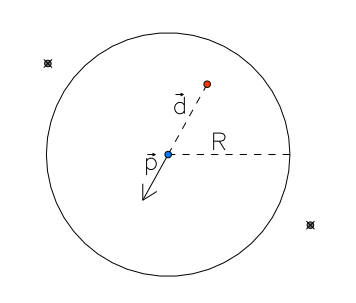
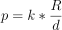
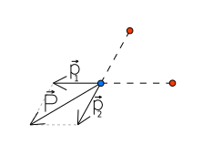
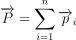
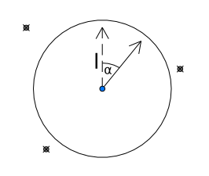

<h1 style='text-align: center'>An</h1>

Ants is a simple web application rendering dots which move avoiding the cursor and each other.  
This project was created with [TypeScript](https://www.typescriptlang.org) [React](https://reactjs.org).
Trigonometric functions have tests created using [Jest](https://jestjs.io).

Ants is available at https://rasmusmerzin.github.io/ants.

## Table of contents
* [Movement](#Movement)
  * [One neighbour in range](#One-neighbour-in-range)
  * [Multiple neighbours in range](#Multiple-neighbours-in-range)
  * [No neighbours in range](#No-neighbours-in-range)
* [Process](#Process)

## Movement

A velocity for each ant is calculated every frame depending on the following conditions.

### One neighbour in range

Constants               | Variables
---                     | ---
`R` ‒ distancing range  | `d` ‒ neighbour distance
`k` ‒ distancing factor | `p` ‒ distancing push

### Multiple neighbours in range

`n` ‒ number of neighbours in range  
`P` ‒ push sum

### No neighbours in range

`l` ‒ previous frame's velocity  
`α` ‒ amount to change velocity angle based on ants agility  
> `(Math.random() -.5) *2 *`_agility_

## Process

It took me about eight hours to work out the trigonometry and to implement it in TypeScript React.
I also wrote automatic tests for the trigonometric functions because I figured these are fundamental and more difficult to debug later on.

It took me about 16 hours more to implement control dock to change settings in real time, ants avoiding the cursor and to add a CSS styling and a few animations.
